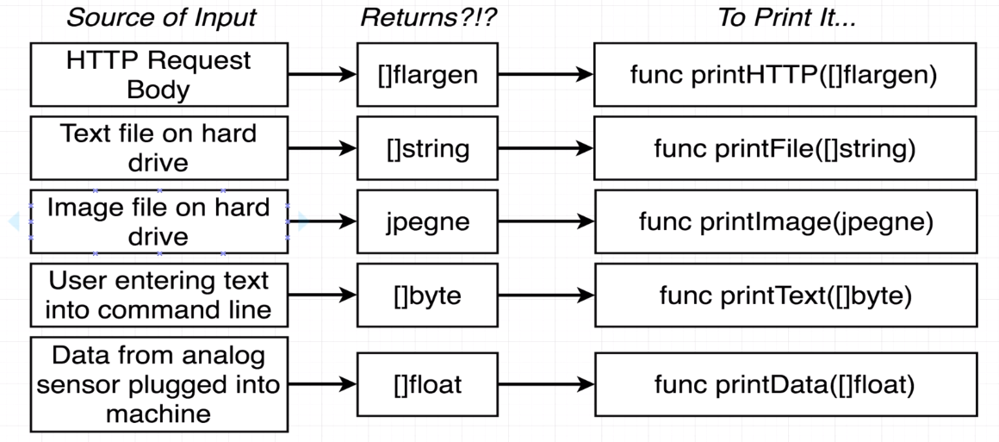
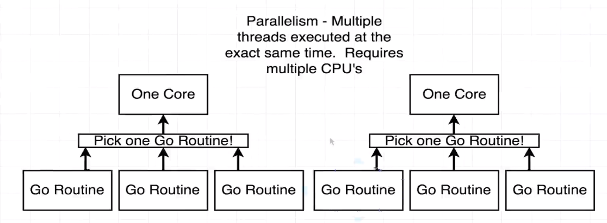
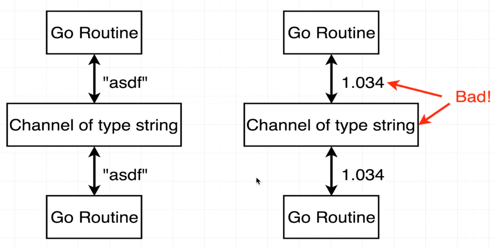

# udemy-golang

My practice code with Udemy Golang course <https://www.udemy.com/go-the-complete-developers-guide/>

---

# Notes

## FAQ

- Golang is a Compiled language.
- Golang is a statically typed language.
- Go is not a Object Oriented Programming Language. It is a procedural Language
- Varaible Declaration is Golang:
  > variableName variableType // myNum int32
- To run it on our local computer we need the Go Runtime which allows us to build and execute Go programs.
- Everything (almost) in go is a Type.
- Any variable that is declared in the code must be used. If we do not want to use it, just use '_' as the variable name.
- := can only be used when declaring and intializing a varaible for the first time and not for reassigning.
- There are not try-catch or Error Handling in Golang as of yet.
- Go by default is pass by value language
- Go does not support overloading. So we cannot have two functions having same name even if their arguments are different. Unless they are reveiver functions and are bounded to different types.

## Questions

### 1. helloworld
- How do we run the go code in our project?
  - The 'go' command gives us the ability to compile and execute our projects.
  - Command to write the project: 
    - > go run main.go"
    - run multiple files:
      - > go run main.go filename.go
  - Go CLI tools
    ```
    go build                    -> Compiles a bunch of go source code files (Creates an executable file)
    go run main.go file1.go ... -> Compiles and executes one or two files
    go fmt                      -> Formats all the code in each file in the current directory
    go install                  -> Compile and "installs" a package
    go get                      -> Downloads the raw source code of someone else's package
    go test                     -> Runs any tests associated with the current project
    go mod init dirname         -> Creates a go module
    go run .                    -> If module is initialized inside the package, then it will execute all the files in the package. Entrypoint being the main function.
    go mod tidy                 -> This command ensures that the go.mod file contains the correct dependencies and versions used in your codebase. This also creates a go.sum file
    ```
- What does 'package main' mean?
  - A package in go is like a project or a workspace.
  - A package is a collection of common source code files.
  - If we were working on one single application, we would traditionally be working on one single package.
  - A package can have many related files inside of it. Each file ending with the extension of .go
  - The only requirement of every file inside a package, is that the first line should declare the package where the file belongs to.
  - So, each file belonging to package main, must have the "package main" written at the top.
  - Now the reason why we called the package as "main" inside helloworld folder, instead of using the folder name, is because:
    - Inside go, there are two different types of packages.
      - Executable -> Generates a file that we can run
      - Reusable -> Code used as 'helpers'. Good place to put reusable logic.
    - Name of the package determines if we are creating an Executable or Dependency type package.
    - So, Specifically the word "main" is used to create executable type package.
    - Any other package name other than "main" will create reusable package.
    - "go build" only creates executable file from Executable package. If we ran it for reusable package, nothing will happen.
    - Reusable packages are a good place to define dependencies (helper code)
    - Anyime we create an Executable package, it MUST have a func called "main". This is the entry point for a program to execute the package.
- What does 'import "fmt"' mean?
  - This line simply means that give my current code, all of the code and functionality contained within the package called "fmt".
  - "fmt" is a standard library package that is included with go by default.
  - "fmt" is kind of a short for "format".
  - The "fmt" library is used to print out information to the terminal.
  - Some of the default standard library packages that come with go by default are:
    - fmt
    - debug
    - math
    - encoding
    - crypto
    - io
    - bufio
    - os
  - We can use the "import" statement to get fuctionalities from not only standard packages but from packages that are built by others as well.
  - In the below link we can get all the standard packages.
    - https://pkg.go.dev/std
  - So, to summarize, we use "import" to gain the functionalities defined in another package inside the package that we are authoring.
- What's that 'func' thing?
  - It is a keyword to declare a function.
- How is the main.go file organized?
  - At the very top, we always do package declaration
    > package main
  - Then we import other packages that we need (standard or other user created)
    > import "fmt"
  - Then at the end we Declare functions, tell Go to do things
    > func main() {
      > fmt.Println("hi there")
    > }
---
### 2. cards
- Functionalities in the Cards game:
  - newDeck -> Create a list of playing cards. Essentially an array of strings
  - print -> Log out the contents of a deck of cards.
  - shuffle -> Shuffles all the cards in a deck.
  - deal -> Create a 'hand' of cards.
  - saveToFile -> Save a list of cards to a file on the local machine.
  - newDeckFromFile -> Load a list of cards from the local machine.
- Variable Declaration in go:
  > var card string = "Ace of Spades"
  - var -> keyword that defines that we are about to create a new variable.
  - card -> The name of the variable.
  - string -> Type of the varaible / Type of value that this variable can store.
  -  "Ace of Spades" -> Value that is stored in the variable.
  -  If we have an unused varaible in our code, lexer will be throwing errors.
     -  Lexer is the one that checks the grammar of the code.
-  Basic Data Types in Go:
   -  bool -> true | false
   -  string -> "Hi!"
   -  int -> 0 | -10000 | 99999
   -  float64 -> 10.000001 | 0.00009 | -100.003
-  Other ways to declare variables in Go:
    - 2nd way:
      > var card = "Ace of Spades"
      - Here the go compiler will infer the type of variable form the value that is getting assigned to it.
      - In this case it is a string
    - 3rd way:
      > card := "Ace of Spades"
      - We can use the walrus operator.
      - Here also the go compiler helps to infer the type of the variable.
      - Walrus operator cannot be used to declare and intialize a variable in global scope.
      - With walrus operator, all three, declaring, initializing and assigning happens in one step.
    - One thing to remember, these two type of declaration does not make our variable dynamic.
    - We can declare and initialize a new variable in this way. But reassigning is not possible. We will need to use '='.
- If we only declare a variable, we can initialize it in a different line. But for the time, the variable is not initalized, go does not store garbage value in them, rather stores some proper values. These are also known as zero value.
  - Zero Value:
    ```
    string -> ""
    int -> 0
    float -> 0
    bool -> false
    ```
- We can declare variables in global scope and later define them in a function.
- Functions in Go:
  > func newCard() string {}
  - func -> Keyword for function
  - newCard -> Name of the function
  - string -> return type of the function (If there are no return type, the function is not expected to return anything).
  - We can use functions, declared in a file, in a different file inside the same package, without importing the declaration file.
  - Return multiple values from a function in Go:
  ```
  func deal(d deck, handSize int) (deck, deck) { 
    //return multiple values
    //Different types can be returned together
    return d[:handSize], d[handSize:] 
  }
  ```
- Syntax to call and recive a function that returns multiple values:
  ```
  hand, remainingDeck := deal(cards, 5)
  //hand, remainingDeck := <deck>, <deck>
  //the first value returned will be stored in hand and the 2nd value returned will be stored in remainingDeck.
  ```
- Data Structure in Go to handle list of records:
  - There are two data structures in Go to handle them:
    - Array -> fixed length list of things
      - > cards := [4]string{}
      - > cards := [4]string{"1","2","3","4"}
      - One thing to note here is that even if no element is inserted in the array, Go will reserve 4 spaces with zero/default values of that type for the array and we can access them without having any values assigned ourselves.
      - This is not the case with slice.
    - Slice -> An array that can grow or shrink with more functionality
      - > cards := []string{}
      - > cards := []string{"1","2","3","4"}
  - Slices and arrays both must be defined with a data type. So, every element in array and slice must be of same type.
  - Append elements to a slice:
    - > cards = append(cards, "Six of Spades")
    - the append function takes all the elements from cards slice, appends "Six of Spades" and then returens a modified slice. 
    - So, append does not modify the real slice, it just returns an updated slice, which we then store in the original slice.
  - Iterating through slices:
    - > for i, card := range cards {fmt.Println(i, card)}
    - i -> index of the element inside the slice
    - card -> Current card we're iterating over
    - range cards -> Take the slice of 'cards' and loop over it
    - We are using the := operator to declare and intialize i and card, as we are throwing out i and card after each iteration. So, it is not reassigning, rather it is a completely new declaration and initialization.
    - Now, as we know each variable tat is declared in our code must be used, otherwise code will throw error, so if we do not wish to use the index of the slices while iterating over it, we can use '_' instead of 'i'.
      - > for _, card := range cards {fmt.Println(card)}
  - Also, we can only iterate over the elements over the index in a slice rather than the elements itself:
    - > for i := range cards {{fmt.Println(i)}}
  - More on Slices:
    - Slices are 0-indexed
    - range in slice:
      - > cards[startIndexIncluding : upToNotIncluding]
      - > cards[ : upToNotIncluding] // [0 : upToNotIncluding]
      - > cards[startIndexIncluding : ] // [startIndexIncluding : len(cards)]
      - This much like list slicing in python.
      - Slicing slices does not modify the real slice.
    - Length of a slice:
      - > len(cards)
- Custom Types in Go:****
  - We can "extend" a base type (string, integer, float, array, map) and add some extra functionality to it.
  - Tell Go we want to create an array of strings and add a bunch of functions specifically made to work with it:
    - > type deck []string{}
      - deck will extend every type of behavior of a slice of string or a string slice.
      - Think of deck as a thin layer or a kind of abstraction, where deck is essectially a string but now we can have particular functions tied to something specifically of type deck.
    - Functions, with 'deck' as a 'receiver' -> A function with a receiver is like a "method" - a function that belongs to an "instance". So, these custom functions will only work with this 'deck' type or are bound to variables of type "deck".
      - We should not make all functions bound to our custom type if they are working on them.
      - Create method (functions with receivers) for our custom type, only if they are acting on the varaible and modifying it.
      - A receiver receives both the arguments as well as the variable on which it is getting called.
    - Now in the codebase we can replace all slice of string or string slice with deck to create new instances of deck type if we wished to.
    - > cards := deck{"Ace of Diamonds", newCard()}
    - Syntax to add functionality/method/Receiver Function with the receiver deck:
      ```
      func (d deck) print() {
        for i, card := range d {
          fmt.Println(i, card)
        }
      }
      ```
        - d -> The actual copy of the deck we're working with is available in the function as a variable called 'd'. d refers to the actual value / actual instance and not a copy of it. [think of d as 'this' equivalent in oops]
        - One thing to note here, is that d is a pass by value here. So, if we do update it, we are essectially updating a copy of d. We are passing d by value.
        - To update d itself, we need to pass it by reference with the help of pointers.
        - Every variable of type 'deck' can call this function on itself
          - > cards.print()
        - By convention we name the receiver by 1 or 2 letters that matches the type of the receiver. Hence, d in the case of type deck. Go does not use words like "this" and "self".
      - Here deck is the receiver to the function print. And it can be defined as d inside the function.
      - As we can see inside the print function, range d, that d refers to the varaible of type "deck" through which this function is called.
      - So, receivers sets up methods on varaibles that we create. Basically associates the methods to varaibles of type "Deck"
    - Syntax when the variable to which the receiver function is bound to is not getting used inside the reciver function:
      ```
      func (deck) print() {
        fmt.println("This function prints a deck")
      }
      ```
      - Notice is this receiver function as we do not use the variable to which the function is bounded to, we do not need to declare the variable, only putting the type name is enough.
- Write to a File in golang: https://pkg.go.dev/os#WriteFile
  > func WriteFile(name string, data []byte, perm FileMode) error
  ```
  package main

  import (
    "log"
    "os"
  )

  func main() {
    //0666 permission means that anyone can read or write in the file
    err := os.WriteFile("testdata/hello", []byte("Hello, Gophers!"), 0666)
    if err != nil {
      log.Fatal(err)
    }
  }
  ```
  - This os.WriteFile(), requires a byte slice as an argument. 
    - Think of of a string of characters evertime you encounter a byte slice
    - Each character in the string can be converted to their ascii value and get stored inside a byte slice. (https://asciitable.com)
      - "Hi there!" (string) -> [72 105 32 116 104 101 114 101 33] (byte slice)
    - Type Conversion from string to byte slice in Go:
      - > []byte("Hi there!")//TypeWeWant(ValueWeHave)
- Read from a File in golang: https://pkg.go.dev/os#ReadFile
  > func ReadFile(name string) ([]byte, error)
  ```
  package main

  import (
    "log"
    "os"
  )

  func main() {
    data, err := os.ReadFile("testdata/hello")
    if err != nil {
      log.Fatal(err)
    }
    os.Stdout.Write(data)

  }
  ```
  - err -> Value of type 'error'. If nothing went wrong, it will have a value 'nil' (null of golang).
- As Golang does not have proper error handling as of yet, we can do any one of the below things in case an error occurs.
  - Log the error and return a default value
  - Log the error and entirely quit the program
    > panic(err)
- Random in Go: https://pkg.go.dev/math/rand
  - > func Intn(n int) int
  - This randome number generator is a pseudo-random generator that depends on some seed value.
  - Think of the seed as some source of randomness inside the number generator.
  - We take the seed and pass it to the random generator and the generator gived random numbers or values.
  - The issue here is that the go random generator by default always uses the exact same seed.
  - So, every time we restart our program and run the random generator, same sequence of random values will get generated as we are using the same exact seed value.
  - In order to fix this, we need to generate some random seed value and then feed it to the random number generator.
  ```
  source := rand.NewSource(time.Now().UnixNano()) //time.Now().UnixNano() this seed value makes sure that the seed passed to the source for rand stays random
  r := rand.New(source)                           //Creating a new rand with our custom seed
  newPosition := r.Intn(len(d) - 1)               //Our randomly seeded rand is used here
  ```
  - But as of Go 1.20, the math/rand package automatically seeds the global random number generator. So, no need for seeding from our side.
- Easy way to swap elements in Go:
  - > d[i], d[newPosition] = d[newPosition], d[i]
- Writing **Tests** in Go:
  - Go testing is not RSpec, mocha, jasmine, selenium, etc!
  - To make a test, create a new file ending in _test.go
    - deck_test.go
  - To run all tests in a package, run the command:
    - > go test
  - We can write Test functions for each individual functions inside a file or we can write a test function for all the closely related functions in the file.
  - Run all tests in go:
    > go test
  - Unlike other languages, Go does not know how many test cases were run inside a function. All Go knows is that we ran a function and either all test cases passed or some/all test cases failed.
  - Whenever we are testing with go, we need to make sure that we need to manually take care of any cleanup that is needed. Because the Go testing framework will not cleanup for us. 
    - For example if we open a file and do something, we need to manually cleanup for it ourselves after operations are done. 
    - The Go testing framework will not detect that we opened a file and did something and automatically clean it up for us.
    - We need to remember this as if for some reason our test crashes midway and the file is not cleaned up, then the next time we run the test case, we will get unwanted results.
    - So, we need to manually cleanup the file after the test runs or even if the test crashes mid way.
- Initaite go module:
  > go mod init cards
  - This will initiate a go module called cards and without go module you can not run tests.
- Formatting:
  - %T -> Type
  - %v -> Any value
  - %+v -> prints out all the properties in a struct
- Printing in Go:
  ```
  fmt.println() // Adds new line at the end. Does not support formatting like %v and %T
  fmt.printf("\n") // Need to manually add the new line character. Supports formatting like %v and %T
  ```
---
### 3. struct
- Struct (Structure): It is a Data Structure. It is a Collection of different properties that are related together.
- Defining, Declaring and Initializing struct:
  ```
  package main

  import "fmt"

  //Defining custom struct type person
  type person struct {
    //properties of the struct
    firstName string
    lastName  string
  }

  func main() {
    //Declaring struct

    //1st way
    // alex := person{"Alex", "Anderson"} //Go assigns values in the order of definition
    // fmt.Println(alex)                  //{Alex Anderson}

    //2nd way
    // alex := person{firstName: "Alex", lastName: "Anderson"} //assigning values directly to the properties without depending on the order of definition
    // fmt.Println(alex)                                       //{Alex Anderson}

    //3rd way [Declaring a struct and then updating values individually]
    var alex person
    fmt.Printf("%+v\n", alex) //{firstName: lastName:}
    fmt.Println(alex)         //{ } <- Two empty strings (filled automatically with default/zero value)
    alex.firstName = "Alex"
    fmt.Println(alex) //{Alex } <- Alex with one empty string for lastName
    alex.lastName = "Anderson"
    fmt.Println(alex) //{Alex Anderson}
  }
  ```
- Embedding one struct in another:
  ```
  package main

  import "fmt"

  type contactInfo struct {
    email   string
    pinCode int
  }
  
  type person struct {
    //properties of the struct
    firstName string
    lastName  string
    //Embedding a strucu inside another struct
    // contact contactInfo
    contactInfo //If we name the property same as it's type, we do not need to specify it's type as the type will get inferred
  }

  func main() {
    //Declaring struct with an embedded struct
    // jim := person{
    // 	firstName: "Jim",
    // 	lastName:  "Party",
    // 	contact: contactInfo{
    // 		email:   "abc@email.com",
    // 		pinCode: 000000,
    // 	},
    // }
    // fmt.Println(jim)         //{Jim Party {abc@email.com 0}}
    // fmt.Printf("%+v\n", jim) //{firstName:Jim lastName:Party contact:{email:abc@email.com pinCode:0}}

    //Declaring struct with an embedded struct
    jim := person{
      firstName: "Jim",
      lastName:  "Party",
      contactInfo: contactInfo{
        email:   "abc@email.com",
        pinCode: 000000,
      },
    }
    fmt.Println(jim)         //{Jim Party {abc@email.com 0}}
    fmt.Printf("%+v\n", jim) //{firstName:Jim lastName:Party contactInfo:{email:abc@email.com pinCode:0}}
    }
  ```
- Struct with receiver function:
  ```
  package main

  import "fmt"

  type contactInfo struct {
    email   string
    pinCode int
  }

  // Defining custom struct type person
  type person struct {
    //properties of the struct
    firstName string
    lastName  string
    //Embedding a strucu inside another struct\
    contactInfo
  }

  func main() {
    jim := person{
      firstName: "Jim",
      lastName:  "Party",
      contactInfo: contactInfo{
        email:   "abc@email.com",
        pinCode: 000000,
      },
    }
    jim.print()              //{firstName:Jim lastName:Party contactInfo:{email:abc@email.com pinCode:0}}
  }

  func (p person) print() {
    fmt.Printf("%+v\n", p)
  }
  ```
- Go by default is pass by value language
  - Meaning, when we pass a variable to a function, that variable is copied with all of it's value(s) to a new memory address and then that is passed.
  - So, if we make any updates in the variable inside the function, it will not be affecting the real variable.
- For receiver functions, by default we pass the varaible by value (pass by value). So, if we update something in the variable, it does not update the real variable, rather updates a copy of that variable (which belongs solely to the function itself).
  - To update the varaible that is passed in the receiver function we need to "pass by reference" with the help of pointers.
  - Example of pass by value to receiver function:
    ```
    func (p person) updateName(newFirstName string) {
      //Here the firsName of the original p will not be updated as we are passing it by value
      p.firstName = newFirstName
    }
    ```
  - Each variable is stored somewhere in the memory address in RAM.
  - Pointers points to the memory address (In RAM) where the variable is stored.
    - \* -> Helps to point to the memory address where variables are stored (Essentially stores the variable's memory address)
    - & -> returns the memory address where the variable is stored
- Updating value of a structure, inside receiver function by using pass by reference through Pointers.
  ```
  package main

  import "fmt"

  type contactInfo struct {
    email   string
    pinCode int
  }

  // Defining custom struct type person
  type person struct {
    //properties of the struct
    firstName string
    lastName  string
    contactInfo
  }

  func main() {
    jim := person{
      firstName: "Jim",
      lastName:  "Party",
      contactInfo: contactInfo{
        email:   "abc@email.com",
        pinCode: 000000,    
      },
    }

    //jimPointer is a pointer of type person holding the memory address were jim struct is located
    //&jim returns a pointer/memory address where the real jim struct copy is stored and assigns it to a pointer
    jimPointer := &jim //var jimPointer *person = &jim 
    jimPointer.updateName("Jimmy")
    jim.print() //{firstName:Jimmy lastName:Party contactInfo:{email:abc@email.com pinCode:0}}
  }

  //This receiver can be called with any pointer to person. Not a person itself.
  func (pointerToPerson *person) updateName(newFirstName string) {
    //pointerToPerson is holding the memory address where the person struct is stored and is of type person pointer
    //pointerToPerson refers to the original copy of the person struct in memory through which this receiver function is called
    //pointerToPerson is the pointer and *pointerToPerson is the value that the pointer is pointing to
    (*pointerToPerson).firstName = newFirstName
  }

  func (p person) print() {
    fmt.Printf("%+v\n", p)
  }
  ```
  - &variable -> Give me the memory address of the value this varaible is pointing at
  - *pointer -> Give me the value this memory address is pointing at (Dreferencing).
  - In the updateName receiver function:
    - *person -> This is a type description - it means we're working with a pointer to a person
    - *pointerToPerson -> This is an operator - it means we want to manipulate the value the pointer is referencing
  - To summarze, pointers are nothing more than memory address. &variables returns the memory address where the variable is tored and pointer stores it to use the original copy later. *pointer helps in accessig the original variable that is stored inside the memory where the pointer is pointing to or storing.
    - **address** | **value**
      - Turn **address**/**pointer** into **value** with ***address**
      - Turn **value** into **address**/**pointer** with **&value**
    - > variableName *variable //*variable is a pointer type
    - > *variableName //*variableName is dereferencing/accessing the variable that is stored in variableName memory address
- We can convert the above code with the below shortcut:
  ```
  package main

  import "fmt"

  type contactInfo struct {
    email   string
    pinCode int
  }

  // Defining custom struct type person
  type person struct {
    //properties of the struct
    firstName string
    lastName  string
    contactInfo
  }

  func main() {
    jim := person{
      firstName: "Jim",
      lastName:  "Party",
      contactInfo: contactInfo{
        email:   "abc@email.com",
        pinCode: 000000,
      },
    }
    jim.updateName("Jimmy") //This works
    jim.print() //{firstName:Jimmy lastName:Party contactInfo:{email:abc@email.com pinCode:0}}
  }

  func (pointerToPerson *person) updateName(newFirstName string) {
    (*pointerToPerson).firstName = newFirstName
  }

  func (p person) print() {
    fmt.Printf("%+v\n", p)
  }
  ```
  - This code works because in Go, we can call a receiver function that is bounded to a pointer type (*person), either with the same pointer type(*person) or with the root type(person). Go will automatically convert the root type to a pointer type for us while calling the receiver function. So, no need for us to explicitly get the pointer type for calling the receiver function, Go will implicitly do it for us.
    - But the opposite is not allowed in Go. That is, we can not call a receiver function that is bounded to a root type(person) using a pointer type(*person)
- **Gotchas** in pointer:
  - When you see a * operator in front of a pointer, it turn the pointer into a value.
  - Go is by default a Pass by Value language. So, if we pass any variable as a argument or as a receiver, that variable is copied in memory and then that copy is sent to the function. So, the function by default will always be working on a copy of our data structure.
    - We can address this problem by modifying the underlying Data Structure through the use of pointers and memory addresses.
    - Even pointers are copied when they are passed to the function directly. So, even though both will be pointing towards the same memory address, but they themselves will be stored in different memory addressed.
  - In case of **slice**, Go does not create a copy of it while passing it to a function. Rather it passes the reference to it.
    ```
    package main

    import "fmt"

    func main() {
      mySlice := []string{"Hi", "There", "How", "Are", "You"}

      updateSlice(mySlice)

      fmt.Println(mySlice) //[Bye There How Are You]
    }

    func updateSlice(s []string) {
      s[0] = "Bye"
    }
    ```
      - To understand the above scenario, we first need to understand the difference between an Array and a Slice.
        - Arrays:
          - Primitive Data Structure
          - Can't be resized
          - Rarely used directly
        - Slices:
          - Can grow and shrink
          - Used 99% of the time for lists of elements
      - When we create a slice, Go creates two separate data structures for us. The first is a slice and the second is an array.
        - slice is a data structure that has 3 elements in it.
          - A pointer, pointing to the head of the underlying array that represents the actual list of items.
          - A capacity number representing how many items the slice can contain at this time.  
          - A length number representing number of elements currently existing inside a slice.
        - The Slice and the array are stored at different paces in the memory.
      - Now the mySlice in the example above is not actually referring to the underlying array. Rather it is pointing to the Slice data structure.
      - So, when we call a function and pass a slice to it, Go behaves as a Pass by value language and copies the original slice to another memory address and then sends copy to the function.
      - Now, the difference here that is not the case for other types is that, even though the slice got copied, the underlying array that both the original and the copied slice are pointing to are same. 
      - This is possible only because, the underlying array is stored in a different memory address.
      - So, when we update any value/modify the underlying array in the copied slice, it is ultimately updating the value of the original underlying array and hence updating the original slice.
  - Now, slices arenot the only types in Go that behaves like this. There are other types like this. We call them Reference Types. Because they are referenceing to another data structure in memory (underlying true source of data).
    - So, in case of these Reference Types, we can create copied of them, but at the end of they day, they will still be pointing towards the same true source of data.
  - Value Types vs Reference Types:
    - Value Types [Use pointers to change these things in a function]
      - int
      - float
      - string
      - bool
      - struct
    - Reference Type [Don't worry about pointers with these]
      - slices
      - maps
      - channels
      - pointers
      - functions
---
### 4. map
- map is a collection of key-value pairs. [Like Dictionaries in Python]
- Both keys and values are statically typed. All keys must be of same type, all values must be same type, keys and values need not be of same type.
- Basic map declaration and adding values:
  ```
  package main

  import "fmt"

  func main() {
    // colors := map[string]string{
    // 	"red":   "#ff0000",
    // 	"green": "#4bf745",
    // }
    // fmt.Println(colors) //map[green:#4bf745 red:#ff0000]

    // var colors map[string]string //Empty map to be filled later
    // fmt.Println(colors) //map[]

    colors := make(map[string]string) //Create an empty map using make function
    fmt.Println(colors)               //map[]
    colors["white"] = "#ffffff"
    fmt.Println(colors) //map[white:#ffffff]
  }
  ```
- Delete elements in a map:
  ```
	colors := make(map[int]string)
	colors[10] = "#ffffff"
	delete(colors, 10)
	fmt.Println(colors) //map[]
  ```
- Iterating over a map:
  ```
  colors := map[string]string{
		"red":   "#ff0000",
		"green": "#4bf745",
		"white": "#ffffff",
	}

  for color, hex := range colors {
		fmt.Println("Hex code for ", color, " is ", hex)
	}
	/*
		Hex code for  red  is  #ff0000
		Hex code for  green  is  #4bf745
		Hex code for  white  is  #ffffff
	*/
  ```
- Maps vs Structs
  - Map:
    - All keys must be the same type
    - Use to represent a collection of related properties
    - All values must be the same type
    - Don't need to know all the keys at compile time
    - Keys are indexed - we can iterate over them
    - Reference Type!
  - Struct:
    - Values can be of different type
    - You need to know all the different fields at compile time
    - Keys don't support indexing - we can't iterate over them
    - Use to represent a "thing" with a lot of different properites
    - Value Type!
---
### 5. interfaces
- Problem that interface solves:
  - Problem:
    - Every value has a type
    - Every function has to specify the type of its arguments
  - Food for thought:
    - Every function we ever write has to be rewritten to accomodate different types even if the logic in it is identical?
  - Interface helps in resolving this issue among others.
- Go does not support overloading. So we cannot have two functions having same name even if their arguments are different. Unless they are reveiver functions and are bounded to different types.
- Code without interfaces:
  ```
  package main

  import "fmt"

  type englistBot struct{}
  type spanishBot struct{}

  func main() {
    eb := englistBot{}
    sb := spanishBot{}

    printEnglishGreeting(eb) //Hello There!
    printSpanishGreeting(sb) //Hola!
  }

  func printEnglishGreeting(eb englistBot) {
    fmt.Println(eb.getGreeting())
  }

  func printSpanishGreeting(sb spanishBot) {
    fmt.Println(sb.getGreeting())
  }

  func (englistBot) getGreeting() string {
    // VERY custom logic for generating an english greeting
    return "Hello There!"
  }

  func (spanishBot) getGreeting() string {
    // VERY custom logic for generating an spanish greeting
    return "Hola!"
  }
  ```  
  - If we use interfaces we can write the same logic that printEnglishGreeting and printSpanishGreeting are implementing in a same function and stop code replication.
  - One thing to note is that, for both receiver functions, getGreeting, we only used the type of the variable not the variable itself. It is allowed as we are not using it anywhere inside the code.
- Code with interface:
  ```
  package main

  import "fmt"

  type bot interface {
    getGreeting() string
  }

  type englistBot struct{}
  type spanishBot struct{}

  func main() {
    eb := englistBot{}
    sb := spanishBot{}

    printGreeting(eb) //Hello There!
    printGreeting(sb) //Hola!
  }

  func printGreeting(b bot) {
    fmt.Println(b.getGreeting())
  }

  func (englistBot) getGreeting() string {
    // VERY custom logic for generating an english greeting
    return "Hello There!"
  }

  func (spanishBot) getGreeting() string {
    // VERY custom logic for generating an spanish greeting
    return "Hola!"
  }
  ``` 
  - Explanation:
    - type bot interface
      - It is telling our program, it has a new type called 'bot' now.
      - Imagine, we are defining some behavior in bot interface that are common to all different bots (englishBot and spanishBot) that we might have. 
      - Those all bots share the same implementation from the base bot interface type.
    - getGreeting() string
      - This line being inside the bot interface is practically telling all the custom types that "If you are a type in this program with a function called 'getGreeting' and you return a string then you are now an honorary member of type bot"
      - So, it basically says that if there are any other type in the program that has a function called getGreeting associated with it (or implements a function called getGreeting. Also, getGreeting is associated with the type and not the other way around. This means that getGreeting expects to see that type.) and returns a string, then that type is automatically promoted to being of type bot (It still retains its orginal type, the bot type is just an addition to it).
      - So, now we can now imagine that englishBot and spanishBot are also of type bot.
    - func printGreeting(b bot)
      - Now that englishBot and spanishBot are also an honorary member of type 'bot', they can now call this function called 'printGreeting'.
  - So, basically in interfaces we provide some kind of description and any type that has attributes matching with those descriptions, become the interface type also. And we can use those types anywhere we expect to see that interface type.
    - Like we can use the englishBot and the spanishBot wherever we expect to see variable of type bot.
- Interface syntax:
  ```
  type user struct {
    name string
  }

  type bot interface {
    getGreeting(string, int) (string, error)
    getBotVersion() float64
    respondToUser(user) string
  }
  ```
  - bot -> Interace name
  - getGreeting -> Function name
  - (string, int) -> List of argument types
  - (string, error) -> List of return types
- If we want a type to qualify as interface type bot, then we need to make sure they fullfill the complete description along with exact argument types and exact return type.
- A function cannot have interface type receiver.
- Example of types:
  - **Concrete Type**: A Concrete type is something that we can actually create a value out of directly and then access it and change it and create new copies of it and what not. Concrete Types are not only the built-in types of the language but also custom ones that we declare by extending some of the different types.
    - map
    - struct
    - int
    - string
    - englishBot
    - and many more...
  - **Interface Type**: We cannot directly create value out of interface type.
    - interface
    - bot
- Extra Notes:
  - Interfaces are **not** generic types => Other languages have 'generic' types - go does not. (From v1.18, go also has generics - [Link](https://go.dev/blog/intro-generics))
  - Interfaces are 'implicit' => We don't manually have to say that our custom type satisfies some interface.
  - Interfaces are a contracct to help us manage types => GARBAGE IN -> GARBAGE OUT. If our custom type's implementation of a function is broken then interfaces won't help us. It means that we can write functions that help types to implement interfaces in an incorrect fashion. So, we need to remember, interfaces are lose suggestions to just help us figure out what functions and types match up where and not help us to write the correct code (Interfaces are there to help with types and not with logic). But if we put together a wrong implementation, everything will still going to compile and run but we will not get our intended output.
  - Interfaces are tough. Step #1 is understanding how to read them => Understand how to read interfaces in the standard lib. Writing your own interfaces is tough and requires experience. 
- Interfaces are not necessary in Go code. But they are good fo code quality.
- A struct or variable can satisfy more than one interface type.
---
### 6. http
- Structure of Response struct - [Link](https://pkg.go.dev/net/http#Response):
  - 
  - The io.ReadCloser interface was specified as a value inside the Response struct. This means that the Body filed inside the Response struct can have any value assigned to it, as long as it fulfills the interface.
  - All we have to do is drill through the documentation and eventually find that we need to define a function called Read and one called Close.
  - So, if we made some kind of struct that had a function called Read and one called Close and obeyed all the types defined, we can then easily create a Response struct and assign it to the Body field.
  - Now lets discuss the below interface syntax - [Link](https://pkg.go.dev/io#ReadCloser):
    ```
    type ReadCloser interface {
      Reader
      Closer
    }
    ```
    - Reader and Closer are themselves interfaces.
    - In Go, we can use different interfaces and assemble them together to form another interface. So, we can embed different interfaces inside one interface.
    - So, to fulfill the ReadCloser interface, the struct first needs to satisfy both Reader and Closer interfaces first. 
    - So, in reality, what truly matters in ReadCloser interface is, what Reader and Closer interface is rquiring of us.
  - If we did not use interfaces to get the body of a Response, then we would need to have different functions to get different type of responses, as they will have different types in their argument list. As shown by the below diagram: 
    - 
  - To not write different functions that essentially do the same thing just because of them having different argument types, we are using interfaces (that Reader interface).
  - Imagine the Reader interface to work something like the below image:
    - 
  - So think of the Reader interface as some kind of interface or adapter that takes inputs from sources that satisfies the Reader interface and convert it to a medium that is easier to work with (byte slice).
  - Now, the Reader interface requires us to define a function called Read ([Link](https://pkg.go.dev/io#Reader)) for any struct to satisfy as a Reader interface type.
  - A more realistic diagram of what the Reader interface is doing is given below:
    - 
    - Here we are saying that every single source of input that will be coming in to our application, will implement the Reader inerface.
    - So, the Request Body has already implemented the Read functon that is described inside the Reader interface.
  - Below is a diagram that shows what exactly the Read function inside the Reader interface does.
    - 
    - So, we send a byte slice to the Read function.
    - The Read function injects the Raw body of response into the byte slice.
    - As values, inside slices can be modified inside another function, now the byte slice that we has sent to Read function has the response in it.
- Getting the source code of a wesite:
  - 
  - Using the Reader interface:
    ```
    bs := make([]byte, 99999)
    resp.Body.Read(bs)
    fmt.Println(string(bs))
    ```
    - Take some data and import it in our application.
  - Using the Writer interface:
    ```
    io.Copy(os.Stdout, resp.Body)
    ```
    - Takes some data and outputs is some sort of channel/output/method of output.
    - So, the Writer interface does the below thing:
      - 
      - The Writer interface is inside the io package [Link](https://pkg.go.dev/io#Reader).
    - io.Copy [Link](https://pkg.go.dev/io#Copy)
      - This function expects two arguments:
        - First, some value that implements the Write function inside the Writer interface (os.Stdout).
        - Second, some value that implements the Read function inside the Reader interface (resp.Body).
      - So, we can think that the Copy function reads something from somewhere outside from our application and writes it inside some outside channel.
      - Below is the description of io.Copy:
        - 
    - Flow of io.Copy:
      - 
  - With the help of interfaces, we can write some of our own custom implementations of he built in package functions.
    - For example. Below is a custom implementation of the Write function inside the Writer interface.
      ```
      type logWriter struct{}

      func (logWriter) Write(bs []byte) (int, error) {
        //Writer interface logic
        fmt.Println(string(bs))

        //Custom implementation of the Writer interface
        fmt.Println("Just wrote this many bytes: ", len(bs))

        return len(bs), nil //The integer should be the number if bytes written in the byte slice that was processed [0 <= n <= len(bs)]
      }
      ```
---
### 7. channels
- A good read for Golang concurrency - [Link](https://gochronicles.com/concurrency-in-go/)
- Channels and Coroutines are both structures in Go that are used to handle concurrent programming.
- Go Routine:
  - Think of Go routines as a separate line of code execution that can be used to handle blocking code.
  - 
  - When we launch a Go program (compile and execute it), we automatically create one Go Routine. 
  - Think of Go Routine as something that exists inside our program/process.
  - Go Routine takes every single line in our program and executes them one by one.
  - A Go routines is a lightweight thread managed by the Go runtime.
  - **Remember though, a goroutine is not the same as a OS thread.**
  - Golang follows Concurrency paradigm.
    - Suppose our CPU has 4 processors and we have 15 go routines.
    - Then 4 routines will get assigned to 4 processors and start executing in parallel.
    - Once one of the routines face some blocking code (io or something else), it will leave the processor free and wait for the blocking code to complete.
    - In the meantime, some other go routine will occupy the free processor and start executing. This is kind of asynchronous.
  - Syntax for Go routine:
    - > go checkLink(link)
      - go -> Create a new thread go routine. We only use the go keywords infront of function calls.
      - checkLink(link) -> Run this function with the newly created go routine
  - What happens when we spawn multipe Go routines inside of our program:
    - With One CPU
      - 
      - Go scheduler works with one CPU on our local machine.
      - So, even if we have dual or quad or more core machine, by default Go will attempt to use onluy one CPU.
      - With one CPU, each Go Routine runs asynchronously on that one CPU.
      - Go scheduler schedules and detects when to let a Go routine use that CPU for execution or when a Go routine is blocked and some other Go routine needs to scheduled to the CPU, respectively.
      - So, as soon as the running Go routine is blocked, Go scheduler pauses it and starts executing the next Go routine. In this way, the code remains **non-blocking**.
      - If the running Go routine is not blocked then the next Go routine starts running after the previous Go routine's complete execution with the help of the Go scheduler.
      - With One CPU, Go routines are not actually running parallelly. Rather they are running asynchronously with the help of Go Scheduler.
    - Multi Core [By default Go tries to use one core! But we can overwrite that setting and make it use multiple cores!]
      - 
      - Now, each CPU core will run one Go routine parallelly.
      - Go scheduler assigns Go routines to each CPU core.
      - Again even with Multiple cores, Go schedulers still make the Go routines run asynchronously.
  - Concurrency is not Parallellism.
    - Concurrency
      - 
      - We can load multipe Go routines in our program but cannot run all of them at the same time.
      - We can schedule Go routines to run. Meaning, we do not need to necessarily wait for one Go routine to finish before moving to the next one.
    - Parallellism
      - 
      - We get parallellism only when we start adding multiple CPU cores on our machine.
  - Go Routines:
    - 
    - Main routine is the default routine.
    - Child routines are not given same priority as the Main routine.
    - The Main Routine is the single routine, that determines when our program exits or ends. Once Main routine ends or exits, the whole program exits.
      - 
    - The Main routine creates Chold routines inside of our programs and goes ahead and executes other code in the program and once it reaches the end, it ends the program, without checking if he child routines completed their execution or not.
    - To make sure, Main routine, does not exit before all the go routines complete their execution, child routines need to inform Main routine of their completion. 
    - For communication between two routines we use **Channels**.
- Channels:
  - Channels are used to communicate in between different running Go routines.
  - For a code to successfully exit, channel needs to be empty.
    - If we sent some value inside the channel but noone received it, then the code will not exit as channel still has message in it.
  - We are going to use Channels to make Main routine aware when each of the Child Go routines have completed their code.
  - So, we need to make one channel, which will communicate between all of the go routines in our program.
  - Channels are the **ONLY** way we have to communicate between the go routines.
  - 
  - Channel kind of intermediates discussion or communication between all the running routines.
  - Think of channel as some kind of chat application. Where running routines can send some message and it will be sent to any other running routine that has access to that channel.
  - Channels are treated as any other value inside of Go.
  - Channels are essenctially created in a same way as we create a struct, slice, int, etc.
  - Channels are actual values that we can pass around. In this case, we will pass around the channels between the different Go routines.
  - Channels are  **typed**. Just like every other variable. The type indicates the information type or the type of the data that we pass inside the channel and share between the different routines.
  - So, the data that is passed between all the routines through the channel must be of the same type.
  - 
  - So, when we create a channel, we create a channel that is meant for sharing a specific type of data throughout our application.
  - Syntax to create a chabbel that communicates using type string:
    - > c := make(chan string)
  - Sending data with Channels:
    - 
    - 
      - We can send value from our Main routine to Child routine and vice versa using channels.
  - Below is the diagram that shows what is happening with our code inside [channels/main.go](https://github.com/Deepbaran/udemy-golang/blob/master/channels/main.go) directory.
    - 
    - 
    - Below diagram can help in understanding what is happening when we use repeating routines (where we continually ping the sites over and over again):
      - 
      - As soon as the routine that fetches google.com, as soon as it completes execution, we want it to fetch google.com immediately again.
      - So, anytime a request completes, we want one to start right back up.
    - Syntax to pause a go routine:
      - > time.Sleep(5 * time.Second)
      - This pauses the current coroutine where it is used to sleep/pause for 5 seconds.
      - It is also a blocking code.
      - Put the sleep statement inside the coroutine that we are panning to pause.
      - Making the Main coroutine pause is not a good idea and we should keep it always awake to receive messages all the time.
      - Add the pause statements inside the child routines.
      - Better to add it before sending message to the channel.
      - Best to use it with function literal.
    - Diagram of the code execution with pause:
      - 
    - Pause/Sleep with function literal.
      ```
      fl := func() {
        time.Sleep(5 * time.Second)
        checkLink(l, c)
		  }
		  go fl()
      ```
      ```
      go func() {
        time.Sleep(5 * time.Second)
        checkLink(l, c)
      }()
      ```
    - From the above Function Literal, we will get the below warning:
      - > loop variable l captured by func literal
    - The main reason we are getting this warning is because Go provides Lexical scoping.
      - Lexical scope is the ability of a function scope to access variables from the parent scope.
    - Below is the diagram to undearstand the warning:
      - 
      - Whenever we receive a value from our channel, we assign it to the variable l in the for loop in our code.
      - So, we can say that the varaible l inside the Main routine is pointing towards some location in the memory that holds the link that we need to fetch.
      - Now, the l variable that we are passing inside the checkLink function inside the function literal is defined in the outer scope of the Function Literal.
      - The Function Literal is getting executed in a new child go routine.
      - This means that the l variable inside the child rotine is also pointing towards the same memory address as the Main routine and getting the same link.
      - Now, as we continue to loop through the variable l, and start to receive messages from the channel, we are constantly changing the value that is assigned to l.
      - So, sometimes l will be google.com and sometimes after we receive the message, it will get a new value inserted to the memory address where l is stored, like stackoverflow.com or facebook.com
      - And every time the Main and Child routine are referencing the same location in memory.
      - That's why we are seeing the warning message. It is saying that the variable l inside the child routine is still looking at the variable in the outer scope (Main routine) which might be a completely new value and might be getting changed over time.
      - So, at first we may have did the Get request with the correct value of link, but after the request is actually resolved, the link might have been changed by the time we get to the lines where we are sending messages/links to the channels.
      - So, we are getting this warning because l inside the child routine is referencing the outer socpe of the function literal. So, we are referencing a varaibale inside a routine, that is being maintained by another go routine.
      - So, in practice, we **NEVER EVER** attampt to use the same variable inside two different routines.
      - Instead we depend on the fact that Go is a Pass by Value language.
      - So, whenever we want to pass some data from the Main routine to the Child routine, when it is created, we are going to make sure that we pass all of that information as an argument to the function that composes the Child routine.
      - Because we will pass it as an argument, it's value will be copied in memory.
      - 
      - Now that the Child routine received a copy of the link, Child routine will have a very stable record of link it is attempting to fetch and Main routine can continue to change the address as much as it pleases as it received new values through the channel, without altering the Child routine. Child routine will keep looking at it's original value.
      - 
      - Updated Function Literal:
        ```
        go func(link string) {
          time.Sleep(5 * time.Second)
          checkLink(link, c)
        }(l)
        ```
      - We **NEVER EVER** access the same variable inside two different routines. We either pass the variable as an argument from Main routine to Child routine or we pass it using channel. We never try to share variables betweenn them.
---